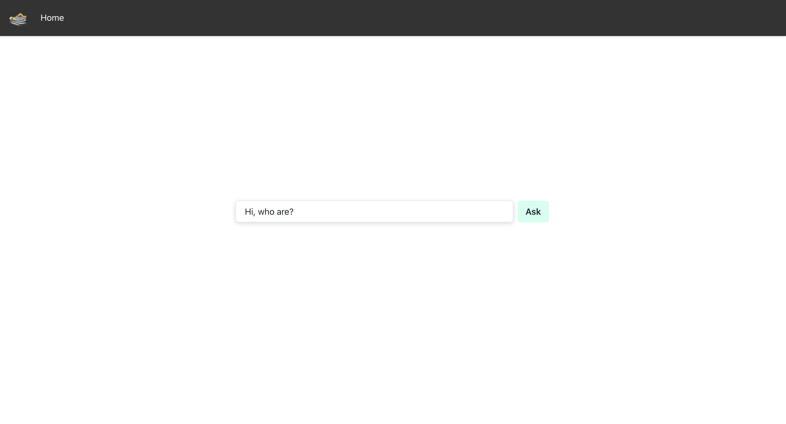

# Reflex Chatbot and Data Processing Application

## Table of Contents
- [Description](#description)
- [Features](#features)
- [Installation](#installation)
- [Reflex Benefits](#reflex-benefits)

## Description

This application is a sophisticated web-based tool that combines the power of AI with interactive user interfaces for efficient data processing and handling. Utilizing the `reflex` library for Python, it provides a chat interface powered by OpenAI's GPT-3.5 model.


*Chatbot Interface*

## Features

- **Interactive Chat Interface**: Engage with an AI chatbot for queries and assistance.
- **File Upload Capability**: Users can upload CSV files for processing.
- **Data Conversion**: Converts text data from PDF files into a structured CSV format.
- **Responsive Web Design**: Accessible and functional on various devices and screen sizes.

## Installation

To set up the project on your local machine, follow these steps:

1. **Clone the Repository**
   ```bash
   git clone [repository URL]
   cd [repository name]
    ```

2. **Install Dependencies**
```bash
pip install -r requirements.txt
```

3. **Set Up Environment Variables**
- Create a .env file in the project root.
- Add your OpenAI API key: OPENAI_API_KEY=your_api_key_here.

4. **Run the Application**
```bash
python reflex_tutorial.py
```

## Reflex benefits
In this project the biggest advantange of Reflex can be clearly seen, the Integration of Frontend and Backend.
In a typical web application, the frontend and backend are distinct; the frontend (often in HTML/CSS/JavaScript) runs in the user's browser, while the backend (in languages like Python, Java, etc.) runs on a server. However, in this project, reflex allows for a more integrated approach, where both frontend and backend elements are defined within the same Python environment. This could be similar to frameworks like Flask or Django but with a more direct method of defining frontend components in Python.

The reflex framework handle the rendering of frontend components and the execution of backend logic, serving as a bridge between the two. This setup suggests an architecture where server-side Python handles both the generation of UI components (sent to the client's browser) and the execution of server-side logic (like API calls and data processing).